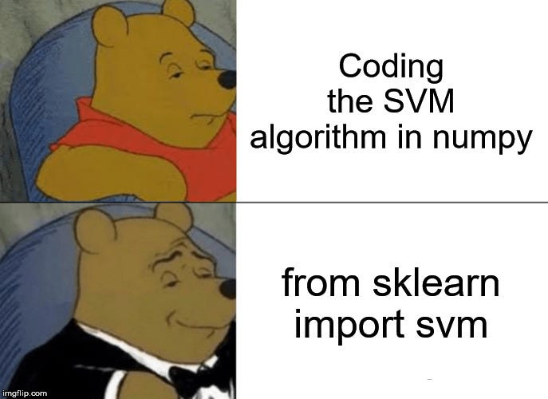

7785-lab6 - Team Naruto watchers[ Rut and Nhi (Leona) ]

For this lab part we use HOG and SVM classifier for identifying the correct labels for each images.

## Insight thoughts:
CYMK and grayscale.- better for color features extraction compared to RGB
HOG - great for shaped-based features
SVM - good with medium-sized dataset like this


Add brightness and contrast to make it easier to train.

## Run the code
Install the required dependencies:
```bash
pip install opencv-python scikit-learn numpy
```
To run, simply execute the python file with the directory of the images in the same folder.
imageDirectory = './2024F_imgs/'
```bash
python ./hog_svm.py
```

## Test result that we got:
Total accuracy: 86.92%
Confusion Matrix:
[[11.  1.  0.  0.  1.  1.]
 [ 0. 23.  2.  0.  0.  0.]
 [ 0.  1. 29.  0.  0.  0.]
 [ 1.  0.  0. 13.  1.  1.]
 [ 0.  0.  1.  1. 10.  0.]
 [ 0.  0.  0.  2.  1.  7.]]

## What else can we do to make it better ?!?